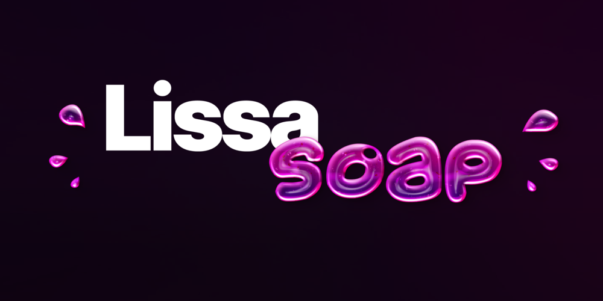

> LissaSoap is a e-commerce web application built with modern technologies and elegant UI.

# About

**LissaSoap** is built with [Next.js](https://nextjs.org/) what allows it to be SEO friendly due to SSG (Static site generation) and SSR (Server side rendering) making content accessible for search engines algorithms. User also benefits from such a technology, getting a quicker access to web app pages.

# Goals
